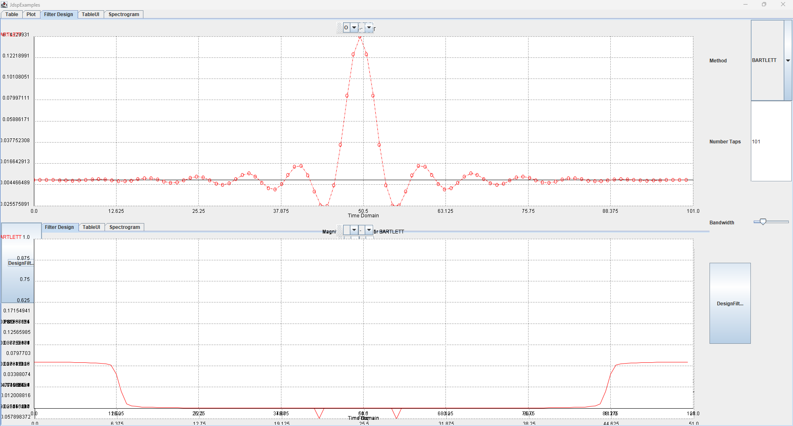

# jdsp

[TOC]

`jdsp` is my initial attempt at building a library for signal processing in the Java language.

# Install

| Dependencies | Description | License | Added |
| :-: | :-: | :-: | :-: |
| JDK21 | Migrated to JDK 21 to support `jdk.incubator.vector` | |  2026-01-17 |
| Efficient Java Matrix Library (EJML) | External matrix library | [LICENSE](EJML_LICENSE-2.0.txt) | 2026-01-18 |
| Apache Commons Math 3 | Math library | [LICENSE-2.0](APACHE_LICENSE-2.0.txt) | 2026-01-21 |

To install, perform the following actions.
1. Build
    ~~~bash
        # Build
        $ gradlew build

        # Run Test
        $ gradlew test

        # Run Example (run the jar and add the incubator)
        $ gradlew runJar
    ~~~
2. Generate Javadoc
    ~~~BASH
        $ gradlew javadoc
    ~~~
3. Publish `jdsp` to the local maven repository to be used in another project (for development only)
    ~~~bash
        $ gradlew publishToMavenLocal
    ~~~
    * Recommendation is to specify version with `SNAPSHOT` (i.e. v1.0.2-SNAPSHOT)
4. Install
    * Add the jar file to the $CLASSPATH
5. Run
    ~~~bash
        java --add-modules jdk.incubator.vector -jar build/libs/jdsp-$VERSION.jar
    ~~~
6. Compiling FAT Jar
    ~~~BASH
        # Use fat jar so it includes dependencies
        $ gradlew shadowJar
    ~~~

# Examples

## Example: Creating and applying a Filter object

~~~java
    import jdsp.filters.Filter;
    // constructor defaults to moving average filter
    Filter f = new Filter(11);
    // update filter
    f.designFilter(101, "HAMMING", 0.1);

    // apply filter
    float[] data0 = {1.0f, 2.0f, 3.4f};
    float[] data1 = {1.0f, 2.0f, 3.4f};
    float [] out1, out2;
    out1 = f.applyFilter(data0);

    // continue filter on second data segment
    out2 = f.applyFilter(data1);
~~~

## Example Plots and Figures

Some functionality was created with Java Swing to provide visual tools to be used with this package.

